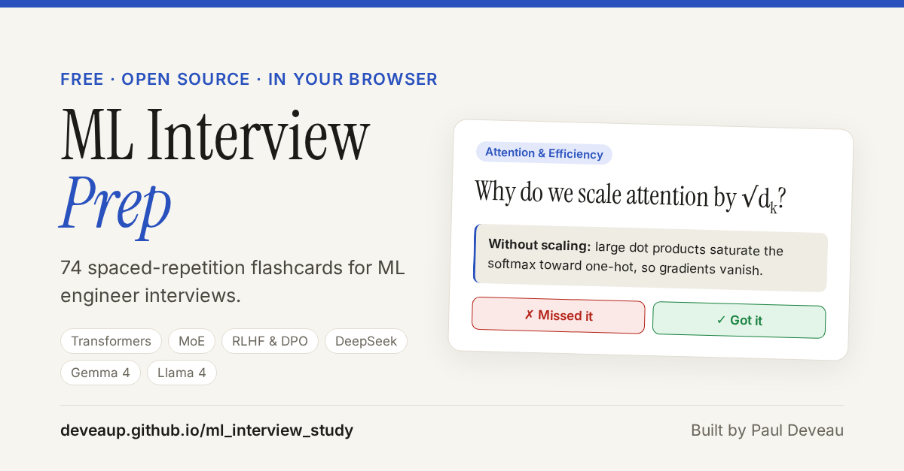

# ML Interview Prep — Quiz App

### ▶ [Play it in your browser](https://deveaup.github.io/ml_interview_study/)

[](https://deveaup.github.io/ml_interview_study/)

A flashcard quiz for ML engineer interview prep, with spaced-repetition-style
weighting so the questions you keep getting wrong show up more often.

74 questions across 18 themes: ML fundamentals, optimization, regularization,
the Transformer, attention efficiency, MoE, the LLM training pipeline,
alignment & RLHF, inference, evaluation, and recent frontier models
(Gemma 3 / 4, Llama 4, DeepSeek V3 / R1, Kimi K2 / K2.5).

Nothing to install and no account: it runs entirely in the browser.

## How to use it

1. Open the [live version](https://deveaup.github.io/ml_interview_study/), or
   clone the repo and open `index.html` in any browser (no server needed).
2. Read the question, then click **Show answer** to reveal it.
3. Mark yourself honestly:
   - **✓ Got it** — you knew the answer.
   - **✗ Missed it** — you didn't, or only partially.
   - **Skip** — move on without scoring (doesn't affect priority).
4. Pick a topic group (Foundations, Transformers & Attention, Training & Alignment,
   Frontier Models) to open its themes and filter on one or several.
   **All topics** clears the filters.
5. Your progress is saved automatically in the browser's local storage
   (per-browser, per-device — it won't sync across machines).
6. The chart icon (top right) shows mastery per theme, creates a shareable image
   of your progress, and has **Reset progress**.

The status chips (to learn / learning / mastered) and the progress bar show how many
questions currently sit in each priority bucket.

### Shortcuts

| Keyboard | Touch | Action |
|---|---|---|
| `Space` / `Enter` | tap the card | Show answer |
| `→` or `2` | swipe right | Got it |
| `←` or `1` | swipe left | Missed it |
| `S` or `↓` | | Skip |

### Links

- `?q=<id>` opens a specific question, e.g. [`?q=tf-2`](https://deveaup.github.io/ml_interview_study/?q=tf-2).
  The link icon on each card copies it.
- `?theme=<theme>` filters on one theme, e.g. `?theme=moe-architecture`.
- `?group=<group>` filters on a group: `foundations`, `transformers`, `training`, `frontier`.

## How the frequency system works

Each question tracks a **consecutive-correct counter (`cc`)** that goes up every
time you answer "Got it" in a row, and resets to `0` the moment you miss it.
That counter maps to a priority level, which controls how often the question
is picked:

| Priority | Consecutive correct | Sampling weight | Meaning |
|----------|---------------------|------------------|---------|
| 🔴 High   | 0 (never gotten right, or just missed) | **10x** | Shown most often — needs work |
| 🟠 Medium | 1–2 in a row | **3x** | Getting there — shown occasionally |
| 🟢 Low ("mastered") | 3+ in a row | **1x** | Rarely shown — you know it |

Questions are picked with **weighted random sampling** each round: a "high"
question is 10x more likely to appear than a "low" one on any given draw, but
nothing is ever fully excluded — even mastered questions resurface now and
then to keep the memory fresh. Missing a question once immediately drops it
back to "high" priority, no matter how many times you'd gotten it right before.

## Files

- `index.html` — the app (structure, styling, and all quiz logic in one file).
- `ml-quiz.html` — redirect to `index.html`, kept so old links still work.
- `questions.js` — the live question bank loaded by the app (`QUESTIONS` array), plus the
  `THEME_GROUPS` used for the filters.
- `diagrams.js` — Mermaid diagrams shown in the app (loaded from a CDN on demand, so they
  need a connection).
- `drafts/questions.json` — a draft/scratch copy of the question bank with `TODO` placeholder answers; not loaded by the app.
- `transformer_diagram.md` — supplementary notes/diagram on the Transformer architecture
  (GitHub-rendered copy; the app uses `diagrams.js`).
- `favicon.svg`, `og-image.png` — icon and link-preview image.

## Adding questions

Questions live in `questions.js` as plain objects:

```js
{
  id: "tf-7",                        // unique; prefix by theme
  theme: "Transformer Architecture", // becomes a filter button
  question: "…",
  answer: `…`,                       // template string, see format below
  diagram: "transformer",            // optional key into DIAGRAMS
},
```

Answer format, rendered by the app:

- `• ` starts a bullet; indent two spaces (`  - ` or `   • `) to nest.
- `1. ` starts a numbered step.
- A short `Label:` at the start of a bullet is shown in bold.
- An indented line containing ` = ` is shown as a formula block; `  → …` as a note.
- Write maths in Unicode (`√dₖ`, `QKᵀ`, `σ`). `x_y` becomes a subscript and `^{…}`
  a superscript.
- A first line `[Glassdoor confirmed: "…"]` adds an "Asked in real interviews" badge.

A new theme appears under "Other" until it's added to `THEME_GROUPS`.
Progress is keyed by `id`, so keep existing ids stable when editing.

Or [suggest a question](https://github.com/DeveauP/ml_interview_study/issues/new?template=question.yml)
without writing code.
