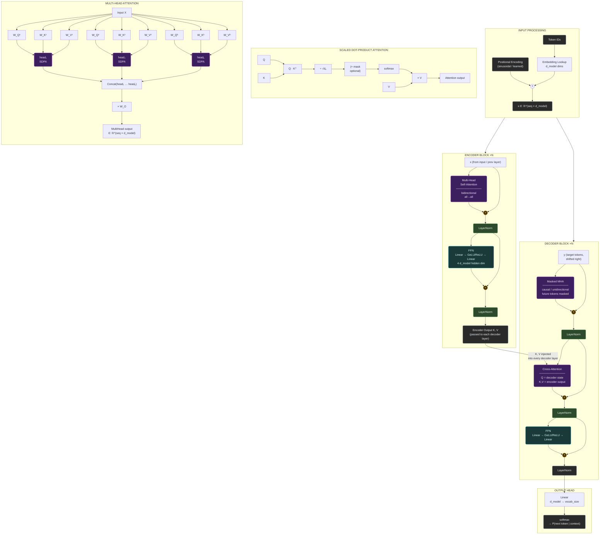

# Transformer Architecture Diagram

---

## Quick-reference formulas

| Component | Formula |
|---|---|
| Scaled dot-product attention | `Attention(Q,K,V) = softmax(QKᵀ / √dₖ) · V` |
| Multi-head | `MultiHead = Concat(head₁…headₕ) · W_O` |
| Per head projections | `W_Q, W_K, W_V ∈ ℝ^(d_model × dₖ)`,  `dₖ = d_model / h` |
| FFN | `FFN(x) = W₂ · GeLU(W₁x + b₁) + b₂` |
| Residual + norm pattern | `LayerNorm(x + Sublayer(x))` |

## Architecture variants

| Model type | Encoder | Decoder |
|---|---|---|
| **Encoder-only** (BERT) | ✅ bidirectional self-attn | ✗ |
| **Decoder-only** (GPT / modern LLMs) | ✗ | ✅ causal masked self-attn only |
| **Encoder–Decoder** (T5, original paper) | ✅ | ✅ + cross-attention |
